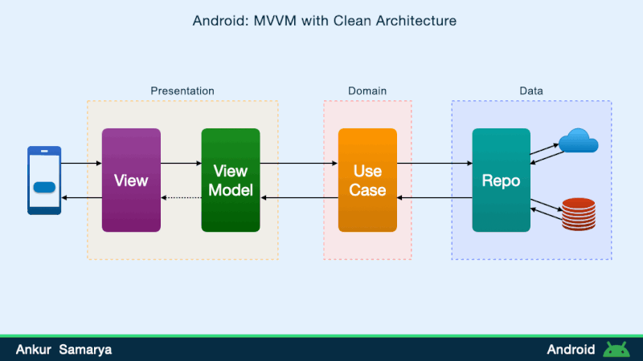

<h1 align="center">Movie Night V2</h1>

The **Movie Night** App is an Android application built using Kotlin and follows the MVVM (Model-View-ViewModel) architectural pattern. It utilizes various libraries and components such as Flow, XML, Room, Retrofit, Dagger Hilt. The app provides several features for movie enthusiasts, including user authentication, movie search, YouTube trailer playback, movie rating, review viewing, movie filtering, watch history, favourites, and user profile.

## Architecture
**Movie Night** is based on the recommended architecture and the Repository pattern, from Google with dependency inversion which follows [Google's official architecture guidance](https://developer.android.com/topic/architecture).

- **UI (Presentation)**: The UI layer handles the app's user interface and interactions. It includes activities, fragments, and XML layouts responsible for displaying information to the user and receiving user input.

- **View Model (Presentation)**: The View Model layer connects the UI with the domain layer. It holds the app's UI-related data using StateFlow or SharedFlow and exposes methods for the UI to interact with.

- **Use Cases (Domain)**: The Domain layer contains the business logic of the app. It defines the use cases and operations that the app can perform.

- **Repository (Data)**: The Repository layer acts as an intermediary between the domain layer and the data sources. It fetches data from remote and local sources, such as APIs or databases, and provides the data to the domain layer.

- **Remote (Data)**: The Remote data source handles data retrieval from remote servers or APIs. The App could be responsible for fetching movie details, trailers, and reviews from [TMDB](https://developers.themoviedb.org/3/getting-started/introduction) API.

- **Local (Data)**: The Local data source manages data storage and retrieval from local databases, such as Room. It handles tasks like saving user ratings, caching movie details, watching history, and favourites.

## Features
- <b>Login and Signup:</b> Users can create an account and log in to the app to access their lists and preferences across multiple devices.
- <b>Browse movies and series:</b> Users can browse the app to discover new movies and series that are categorized as new, latest, popular, top-rated, or by genre.
- <b>Browse actors and their works:</b> Users can browse actors' profiles and their past work, such as movies and series.
- <b>Search for movies, series or actors:</b> Users can search for specific movies, series, or actors using a search bar with predictive search suggestions.
- <b>Review and comment:</b> Users can add reviews and comments to movies and series, sharing their opinions and thoughts about the content.
- <b>Create custom lists:</b> Users can create custom lists to keep track of the movies and series they want to watch, such as a watch later list or a list of favourites.
- <b>Watch trailers:</b> Users can watch trailers of movies and series to get a glimpse of the content before watching it.

## Tech Stack
- [Kotlin](https://developer.android.com/kotlin) - Kotlin is a programming language that can run on JVM. Google has announced Kotlin as one of its officially supported programming languages in Android Studio, and the Android community is migrating at a pace from Java to Kotlin.
- [Material 3](https://m3.material.io/foundations/accessible-design/overview) - Latest Material design for Android.
- Jetpack:
    - [Lifecycle](https://developer.android.com/topic/libraries/architecture/lifecycle) - Lifecycle-aware components perform actions in response to a change in the lifecycle status of another component, such as activities and fragments. These components help you produce better-organized, and often lighter-weight code, that is easier to maintain.
    - [ViewModel](https://developer.android.com/topic/libraries/architecture/viewmodel) -The ViewModel class is designed to store and manage UI-related data in a lifecycle-conscious way.
    - [Data Store](https://developer.android.com/jetpack/androidx/releases/datastore) to store data locally, which can improve performance and offline support.
    - [DataBinding](https://developer.android.com/topic/libraries/data-binding) -Binds UI components in your layouts to data sources in your app using a declarative format rather than programmatically.
    - [Navigation](https://developer.android.com/jetpack/androidx/releases/navigation) to navigate between screens, which can improve user experience.
    - [Paging 3 library](https://developer.android.com/topic/libraries/architecture/paging/v3-overview) - The Paging library helps you load and display pages of data from a larger dataset from local storage or over the network. This approach allows your app to use both network bandwidth and system resources more efficiently.
- [Kotlin Coroutines](https://developer.android.com/kotlin/coroutines) - A concurrency design pattern that you can use on Android to simplify code that executes asynchronously.
- [Retrofit](https://square.github.io/retrofit) -  Retrofit is a REST client for Java/ Kotlin and Android by Square Inc. under Apache 2.0 license. It's a simple network library that is used for network transactions. By using this library we can seamlessly capture JSON response from web service/web API.
- [Kotlin Flow](https://developer.android.com/kotlin/flow) - In coroutines, a flow is a type that can emit multiple values sequentially, as opposed to suspend functions that return only a single value.
- [Room](https://developer.android.com/jetpack/androidx/releases/room?gclid=CjwKCAjww8mWBhABEiwAl6-2RXqgw6-tYMdlLGJiAhLnEl9PNim-Sz8lx9P6JCaOD9qfQQojs-4DoRoCPkAQAvD_BwE&gclsrc=aw.ds) - Modern SQLite build on top of traditional SQLite, use for local database storage.
- [Dagger Hilt](https://developer.android.com/training/dependency-injection/hilt-android) - A dependency injection library for Android that reduces the boilerplate of doing manual dependency injection in your project.
- [Logging Interceptor](https://github.com/square/okhttp/blob/master/okhttp-logging-interceptor/README.md) -  logs HTTP request and response data.
- [Coil](https://coil-kt.github.io/coil/compose/)- An image-loading library for Android backed by Kotlin Coroutines.

