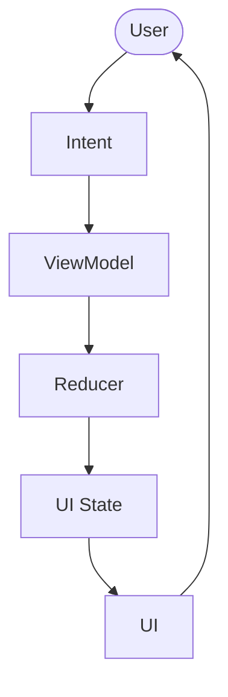

<h1 align="center">🎬 Movie Night | Modern Android Application</h1>
<p align="center">
A production-inspired Android movie discovery application built with Kotlin using
<b>Multi-Module Clean Architecture</b>, <b>MVI</b>, and modern Android development practices.
</p>

<p align="center">
  
  
  
  
  
</p>

---

# Overview

**Movie Night** is a modern Android application that allows users to discover, search, and explore movies and TV shows using **The Movie Database (TMDB)** API.

The application follows **Google's recommended Android architecture** using **Clean Architecture**, **MVI**, **Repository Pattern**, and **Multi-Module Architecture** to achieve scalability, maintainability, and testability.

# Architecture

- **Multi-Module Architecture** — separates features and shared components into independent Gradle modules.
- **Clean Architecture** — organizes the project into Presentation, Domain, and Data layers.
- **MVI (Model-View-Intent)** — provides predictable UI state management with unidirectional data flow.
- **Repository Pattern** — abstracts data sources behind a single access point.
- **Dependency Injection (Hilt)** — manages dependencies across modules.
- **Offline-first caching** — uses Room to cache data and improve the offline experience.

---

#  Features

###  Movies & TV Shows
- Browse Trending, Popular, Top Rated, and Upcoming content.
- Discover Movies by Category and Genres.
- Integrated YouTube player for trailers.

###  Search
- Predictive search for Movies, TV Shows, and Actors.
- Search suggestions and history.

###  Movie Details
- Comprehensive information: Ratings, Cast, Crew, and Reviews.
- Similar movies and personalized recommendations.

###  User Features
- Secure Authentication and Profile management.
- Personalized Watchlist and Favorites.
- Detailed Watch History.

###  UI & UX
- **Material Design 3** implementation.
- Full support for **Light and Dark themes**.
- Smooth animations and responsive layouts.

---

#  Project Structure

```text
movie-night
│
├── app                 # Application entry point
│
├── core
│   ├── common          # Shared utilities and extensions
│   ├── data            # Repository implementations
│   ├── database        # Room database
│   ├── datastore       # DataStore preferences
│   ├── domain          # UseCases & repository interfaces
│   ├── network         # Retrofit & API services
│   └── ui              # Shared UI components
│
├── feature
│   ├── auth            # Authentication
│   ├── home            # Home screen
│   ├── search          # Search
│   ├── details         # Movie details
│   ├── explore         # Discover content
│   ├── watchlist       # Watchlist
│   ├── player          # Trailer player
│   ├── profile         # User profile
│   ├── tvshow          # TV Shows
│   └── showmore        # Show more content
│
└── build-logic         # Convention plugins & Gradle configuration

```

## MVI (Model-View-Intent)

MVI ensures a unidirectional data flow, making the UI state predictable and easier to debug.


```mermaid
flowchart TD

User([User])

Intent[Intent]

VM[ViewModel]

Reducer[Reducer]

State[UI State]

UI[UI]

User --> Intent
Intent --> VM
VM --> Reducer
Reducer --> State
State --> UI
UI --> User
```

---

# Tech Stack

- Kotlin
- XML
- Clean Architecture
- Multi-Module
- MVI
- Coroutines
- Flow
- StateFlow
- Paging 3
- Room
- Retrofit
- OkHttp
- Hilt
- Navigation Component
- DataStore
- Coil

---

# Light and Dark Theme

The app supports both **Light** and **Dark** themes, which can be toggled based on system preferences.

## Light Theme
|                                                        |                                                       |                                                     |
|:------------------------------------------------------:|:-----------------------------------------------------:|:---------------------------------------------------:|
|   |  |    
|   |  |  
|   |  |  
|   |  | 

## Dark Theme

|                                                        |                                                       |                                                     |
|:------------------------------------------------------:|:-----------------------------------------------------:|:---------------------------------------------------:|
|   |   | 
|   |  |  
|   |  | 
|   |  |  
---

#  Getting Started

## Prerequisites
- Android Studio Koala+
- JDK 17+

## Setup
1. **Clone the repository**:
   ```bash
   git clone https://github.com/islamelhady/movie-night-v2.git
   ```

2. **Configure TMDB API**:
   Create a `local.properties` file in the root directory and add:
   ```properties
   API_KEY=YOUR_API_KEY
   BASE_URL=https://api.themoviedb.org/3/
   IMAGE_BASE_PATH=https://image.tmdb.org/t/p/
   TMDB_SIGNUP_URL=https://www.themoviedb.org/signup
   ```
   *Obtain your key at [developer.themoviedb.org](https://developer.themoviedb.org/)*

3. **Build & Run**:
   Open in Android Studio, sync Gradle, and press **Run**.

---

#  Author

**Islam Elhady**
Android Developer

- **GitHub**: [islamelhady](https://github.com/islamelhady)
- **LinkedIn**: [islam-elhady](https://www.linkedin.com/in/islam-elhady/)

---

#  Support
If you found this project helpful, consider giving it a ⭐ on GitHub!

